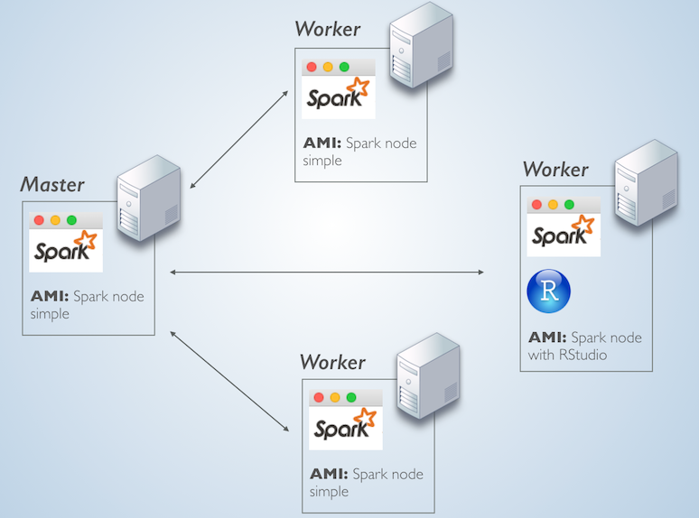

## Introduction

Pairing Spark with S3 is becoming increasingly popular approach.  It allows us to separate the analytics engine from the data source, thus enabling the use of more recent versions of Spark. In contrast, managed clusters like YARN, the version available to analysts usually lags from the most recent version of Spark.

We have experimented with multiple permutations of settings and data ingestion strategies to find an approach that we believe optimal.  We will share this approach through an example.

## Spark Cluster

We created a four node Spark Standalone cluster in AWS EC2. R, RStudio and sparklyr are installed in only one node.  We also have a guide to deploy Spark Standalone on <a href = "http://spark.rstudio.com/examples-sa.html">this page. </a>

Here is a conceptual layout of the cluster setup:

<center><a href="http://spark.rstudio.com/examples-sa.html">
  
</a></center>

The master

<center><a href="images/examples-s3/spark_master.png">
  
</a></center>


## S3 Data

We uploaded six files to a **private S3 bucket**.  The original files are found in the ASA Website here: http://stat-computing.org/dataexpo/2009/

As shown in the screenshot below, the files are compressed and around 100 megabytes in size. All together, the six files are 1.6 gigabytes when expanded.

<center><a href="images/examples-s3/s3-bucket.png">
  
</a></center>

### Multiple files

Since Spark is able to read files in parallel, it is better to have multiple files with the same layout as the datasource than one larger file.  This makes it ideal for accumulative data, because there no need to add a step of appending all of the files into one.

In R, **spark_read_csv** is able to read all of the files inside the bucket or a folder inside the bucket by passing an asterix instead of a specific the file name. For this example, the *path* argument is this: s3a://flights-data/*

## Install and load libraries

In order to use Spark version 2.1.0 we will need to install the development version of sparklyr.  

```{r, warning = FALSE, message = FALSE, eval = FALSE}
devtools::install_github("rstudio/sparklyr", force = TRUE)
```

The two packages needed are sparklyr and dplyr:
```{r, eval = FALSE}
library(sparklyr)
library(dplyr)
```

```{r, include = FALSE}
library(sparklyr)
library(dplyr)
```

## AWS Access Keys

In order to download the data into Spark, AWS Access Keys are needed because the S3 bucket is private.  To learn how to setup a new keys, please review the AWS documentation: http://docs.aws.amazon.com/general/latest/gr/managing-aws-access-keys.html

We pass the keys to R via Environment Variables:
```{r, eval = FALSE}
Sys.setenv(AWS_ACCESS_KEY_ID="[Your access key]")
Sys.setenv(AWS_SECRET_ACCESS_KEY="[Your secret access key]")
```


```{r, include = FALSE}
source("localonly/aws-credentials.R")
```

## Connect to Spark


There are two main sparklyr configuration settings, the first one is required in order to connect to S3. 

A considerable amount of time was spent testing different packages and settings in order to identify the required and important ones to have.

In order to properly create a variable to hold the configuration needed, we start by copying the default configuration into a new variable
```{r}
conf <- spark_config()
```

Now the variable named *conf* can be used to add the two settings.  Again, this first one is required in order to read data from S3.  At the time of writing this article, the most recent version was 2.7.3. To check for more recent versions, we found this page very useful: https://mvnrepository.com/artifact/org.apache.hadoop/hadoop-aws

```{r}
conf$sparklyr.defaultPackages <- "org.apache.hadoop:hadoop-aws:2.7.3"
```

The second setting is not required, but it is important to mention because of two reasons:

- Is the only performance related setting that a Spark Stand Alone cluster will respect one at connection time
- If more than the available RAM is requested, then Spark will set the Cores to 0 thus rendering the session unsusable.  For this exercise, we used *t2.xlarge* EC2 instances that have 16 megabytes of RAM, so we will request 14 gigabytes.

```{r}
conf$spark.executor.memory <- "14g"
```

There are three higlights to mention about the actually connecting to the Spark cluster:

- The master will be the Spark Master's URL, this should start with "spark://" 
- Point the Spark Home to the location where Spark was installed in this node
- Pass the **conf** variable as the value for the **config** argument

```{r, eval = FALSE}
sc <- spark_connect(master = "[Spark Master URL]", 
                    spark_home = "/[Path to]/spark-2.1.0-bin-hadoop2.7/",
                    config =  conf)
```

This is the actual connection command used for this example
```{r}
sc <- spark_connect(master = "spark://ip-172-30-1-5.us-west-2.compute.internal:7077", 
                    spark_home = "/home/ubuntu/spark-2.1.0-bin-hadoop2.7/",
                    config =  conf)
```

<center><a href="images/examples-s3/sparkui_connected.png">
  
</a></center>

## Reading S3 data

This is the second activity where we spent a lot of time testing different approaches.  The one used in this example was selected because of the stage in the data ingestion where it spents most and least time.  

### Approach

The idea is to have Spark just map the files, but not load them into memory (Storage).  Instead, we load subsets of the data to Spark memory, like the a tidy dataframe.  

In our performance testing, this cluster mapped the data in 37 seconds and 1/20 of second to cache a data set that has all of the rows for three columns. 

This approach made the most sense, since in a regular Data Science project, we would map the data one time, and then cache multiple smaller subsets for exploration and modeling. 

Other approaches had reverse results, so data exploration would take more time.  We also tested loading the entire data set into memory, which took 114 seconds, but it didn't make caching smaller datasets any faster.

In a Spark project, it is important to cache the data sets that will be used for modeling because of time performance

### Reading the schema

For reading S3 data, the Apache Hadoop's documentation recommends using the **s3a** URI scheme for Hadoop version 2.7 or newer.  The Hadoop version used in this example is 2.7.3 (*org.apache.hadoop:hadoop-aws:2.7.3*). For more information, here is the link: https://wiki.apache.org/hadoop/AmazonS3 

Setting the **memory** argument to FALSE, will tell Spark to not load the data into memory.  

```{r}
flights <- spark_read_csv(sc, name = "flights_spark",
                         path = "s3a://flights-data/full/*",
                         header = TRUE,
                         memory = FALSE)
```


<center><a href="images/examples-s3/spark_tab.png">
  
</a></center>

```{r}

tidy_flights <- tbl(sc, "flights_spark") %>%
  mutate(ArrDelay = as.integer(ArrDelay),
         DepDelay = as.integer(DepDelay),
         Distance = as.integer(Distance)) %>%
  filter(!is.na(ArrDelay)) %>%
  select(DepDelay, ArrDelay, Distance) %>%
  sdf_register("tidy_spark")

```

<center><a href="images/examples-s3/tidy_registered.png">
  
</a></center>


```{r}
tbl_cache(sc, "tidy_spark")
```

<center><a href="images/examples-s3/tidy_memory.png">
  
</a></center>


```{r}
tbl(sc, "tidy_spark") %>% tally
```

```{r}
simple_model <- tidy_flights %>%
  ml_linear_regression(DepDelay~.)
```

```{r}
summary(simple_model)
```

```{r}
spark_disconnect(sc)
```