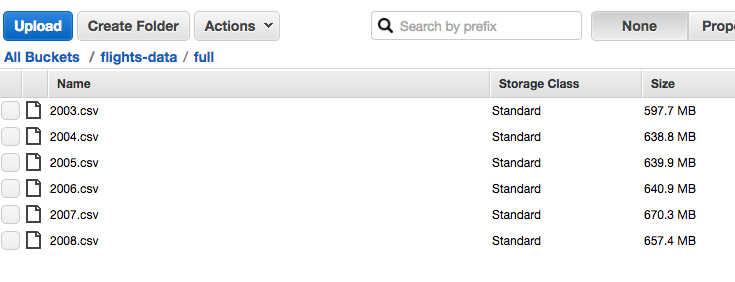

## Introduction

Pairing Spark with S3 is becoming an increasingly popular approach.  Because it separates the data from the computation, it lets us tear down or the Spark cluster when we are done with the analysis without loosing the source data.

We thought it would be a good idea to run some experiments to find a recommendation that may work for those who are currently or thinking about using this approach for their analyses.  

The article will cover the following:

* The packages and stetting needed to connect R to Spark in Standalone mode and S3
* A recommended approach to work with data from S3


## Summary

If you are looking for the key points, and would prefer to skip the full article.  Here is a bulleted list separated by major function.  Some of the bullets in the list are followed by snippets of the code we used:

* **spark_connect**
    + Only one package is needed to read S3 data: **org.apache.hadoop:hadoop-aws** 
    ```
    conf$sparklyr.defaultPackages <- "org.apache.hadoop:hadoop-aws:2.7.3"
    ```
    + **spark.executor.memory** is the only Spark parameter that we can tweak on a Standalone cluster
    + Do not request more **spark.executor.memory** than what is available in a single cluster 
    ```
    conf$spark.executor.memory <- "14g"    # Each executor server had 14.7GB available
    ``` 
* **spark_read_csv**
    + Try using **s3a** URI scheme first
    + Multiple smaller files with the same format are preferable than one large file in S3.  Spark can read each file in parallel, and thus accelerating the data import considerably.  The path passed to `spark_read_csv` would then be just the folder or bucket where the files are located:
    ```
    path =  "s3a://flights-data/full"
    ```
    + Load the full data set into Spark memory if there's enough total memory in the cluster .  This will make later queries run very fast: 
    ```
    memory = TRUE
    ```                          
    + Defining the column names accelerates the initial data read.  To do this you use the `columns` and the `infer_schema` arguments. If there are any `NA` values in numeric fields, define the column as `character` and then convert it on later subsets using `dplyr`
    ```
    columns = list(...ArrDelay = "character", DepDelay = "character",...),
    infer_schema = FALSE)
    ```
- **dplyr**
    + It is better to use `as.integer` and not `as.numeric` if columns that are defined as `character` are really `integer`.  The size of the resulting dataset in Spark memory is considerably smaller when using integers
```
  mutate(ArrDelay = as.integer(ArrDelay)
```
    + Load subsets of data into Spark memory that will be used for modeling.  In R, this done with two sequenced operations: Register and then Cache
```
sdf_register(tidy_flights, "tidy_spark") 
tbl_cache(sc, "tidy_spark")
```     


## AWS

### Spark Cluster (EC2)

We created a four node Spark 2.1.0 Standalone cluster in AWS EC2. **R, RStudio and sparklyr are needed in only one node.**  Here is a conceptual layout of the cluster setup:

<center><a href="http://spark.rstudio.com/examples-sa.html">
  
</a></center>
<br/>
The Spark Master's UI can be accessed via port 8080. Let's highlight a couple of points that are important in later steps:

* **Memory** - Each **Executor** has 14.7GB available in Memory, this is important to know when requesting memory resources (`spark.executor.memory`)
* **URL** - This is the value that needs to be used as the `master` in the `spark_connect` function

<center><a href="images/examples-s3/spark_master.png">
  
</a></center><br/>

**If you plan to follow along**, we have a guide to deploy Spark Standalone <a href = "http://spark.rstudio.com/examples-sa.html"> here. </a> Please note that the instructions are for Spark version 2.0.1,  make sure to replace the version references.

### S3 Data

We uploaded six CSV files to a **private S3 bucket**.  The original files are found in the ASA Website here: http://stat-computing.org/dataexpo/2009/

As shown in the screenshot below, the files are around 600 megabytes in size. All of the files have the exact same layout.

<center><a href="images/examples-s3/s3-bucket.png">
  
</a></center>

#### Multiple files

Since Spark is able to read files in parallel, it is better to have multiple files with the same layout as the source data than one large file. In R, **spark_read_csv** is able to **read all of the files inside the bucket or a folder in the bucket**. For this example, the `path` argument is this: `s3a://flights-data/full`

We are in essence taking advantage of Hadoop's **schema-on-read** technique.  This approach is then ideal for accumulative data, like daily transactions or log files, because we can save new files to the bucket in a regular interval, so at analysis time we won't need to append all of the files into one large one. 

## R

### Install and load Libraries

In order to use Spark version 2.1.0, we will need to **install the development version of sparklyr**.  
```{r, warning = FALSE, message = FALSE, eval = FALSE}
devtools::install_github("rstudio/sparklyr", force = TRUE)
```

The two packages needed for this example are sparklyr and dplyr:
```{r, eval = FALSE}
library(sparklyr)
library(dplyr)
```

```{r, include = FALSE}
library(sparklyr)
library(dplyr)
```

### AWS Access Keys

AWS Access Keys are needed to access S3 data.  To learn how to setup a new keys, please review the AWS documentation: http://docs.aws.amazon.com/general/latest/gr/managing-aws-access-keys.html

We pass the keys to R via Environment Variables:
```{r, eval = FALSE}
Sys.setenv(AWS_ACCESS_KEY_ID="[Your access key]")
Sys.setenv(AWS_SECRET_ACCESS_KEY="[Your secret access key]")
```


```{r, include = FALSE}
source("localonly/aws-credentials.R")
```

### Connecting to Spark

There are four key settings needed to connect to Spark and use S3:

* A Hadoop-AWS package
* Executor memory (key but not critical)
* The master URL
* The Spark Home 

To connect to Spark, we first need to initialize a variable with the contents of *sparklyr* default config (`spark_config`) which we will then customize for our needs
```{r}
conf <- spark_config()
```

**Hadoop-AWS package**: A Spark connection can be enhanced by using packages, please note that these are not R packages. For example, there are packages that tells Spark how to read CSV files, Hadoop or Hadoop in AWS.  In order to read S3 buckets, our Spark connection will need a package called *hadoop-aws*.  If needed, multiple packages can be used.  We experimented with many combinations of packages, and determined that for reading data in S3 we only need the one.  The version we used, 2.7.3, refers to the latest Hadoop version, so as this article ages, please make sure to check this site to ensure that you are using the latest version: 
https://mvnrepository.com/artifact/org.apache.hadoop/hadoop-aws

```{r}
conf$sparklyr.defaultPackages <- "org.apache.hadoop:hadoop-aws:2.7.3"
```

The second setting is **Executor Memory**, as mentioned above this setting key but not critical.  There are two points worth highlighting about it:

- Is the only performance related setting in a Spark Stand Alone cluster that can be tweaked, and in most cases because Spark defaults to a fraction of what is available,  we then need to increase it by manually passing a value to that setting. 
- If more than the available RAM is requested, then Spark will set the Cores to 0, thus rendering the session unusable.  As showed in the 
*Spark Cluster* section, the total available Memory in each executor is 14.7GB

```{r}
conf$spark.executor.memory <- "14g"
```

There are three important points to mention when executing the `spark_connect` command:

- The master will be the **Spark Master's URL**.  To find the URL, please see the *Spark Cluster* section.
- Point the **Spark Home** to the location where Spark was installed in this node
- Make sure to the *conf* variable as the value for the `config` argument

```{r}
sc <- spark_connect(master = "spark://ip-172-30-1-5.us-west-2.compute.internal:7077", 
                    spark_home = "/home/ubuntu/spark-2.1.0-bin-hadoop2.7/",
                    config =  conf)
```

Here is the resulting *Executors* page of our new Spark session.  

<br/>
<center><a href="images/examples-s3/sparkui_connected.png">
  
</a></center>

### Data Import/Wrangle approach

As mentioned at the beginning of the article, we experimented with multiple approaches.  Most of the factors for settling on a recommended approach were made based on the speed of each step.  

The premise is that we would rather wait longer during Data Import, if it meant that we can much faster Register and Cache our data subsets during Data Wrangling, especially since we would expect to end up with many subsets as we explore and model.  

The selected combination was the second slowest during the Import stage, but the fastest when caching a subset, by a lot.  In our tests, it took 72 seconds to read and cache the 29 columns of the 41 million rows of data, the slowest was 77 seconds.  But when it comes to registering and caching a considerably sizable subset of 3 columns and almost all of the 41 million records, this approach was 17X faster than the second fastest approach.  It took 1/3 of a second to register and cache the subset, the second fastest was 5 seconds.

To implement this approach, we need to set three arguments in the `spark_csv_read` step:

* `memory`
* `infer_schema`
* `columns`

Again, this is a recommended approach.  The `columns` argument is needed only if `infer_schema` is set to `FALSE`.    When `memory` is set to `TRUE` it makes Spark load the entire dataset into memory, and setting `infer_schema` to `FALSE` prevents Spark from trying to figure out what the schema of the files are. By trying different combinations the `memory` and `infer_schema` arguments you may be able to find an approach that may better fits your needs.

#### Reading the schema

Surprisingly, another critical detail that can easily be overlooked is choosing the right *s3* URI scheme. There are two options: s3n and s3a.  In most examples and tutorials I found, there was no reason give of why or when to use which one.  The article the finally clarified it was this one: https://wiki.apache.org/hadoop/AmazonS3 

The gist of it is that *s3a* is the recommended one going forward, especially for Hadoop versions 2.7 and above. This means that if we copy from older examples that used Hadoop 2.6 we would more likely also used s3n thus making data import much, much slower. 

### Data Import

After the long introduction in the previous section, there is only one point to add about the following code chunk.  If there are any `NA` values in numeric fields, then define the column as `character` and then convert it on later subsets using `dplyr`.  The data import will fail if it finds any `NA` values on numeric fields.  This is a small trade off in this approach because the next fastest one does not have this issue but is 17X slower at caching subsets.

```{r}
flights <- spark_read_csv(sc, "flights_spark", 
                          path =  "s3a://flights-data/full", 
                          memory = TRUE, 
                          columns = list(
                            Year = "character",
                            Month = "character",
                            DayofMonth = "character",
                            DayOfWeek = "character",
                            DepTime = "character",
                            CRSDepTime = "character",
                            ArrTime = "character",
                            CRSArrTime = "character",
                            UniqueCarrier = "character",
                            FlightNum = "character",
                            TailNum = "character",
                            ActualElapsedTime = "character",
                            CRSElapsedTime = "character",
                            AirTime = "character",
                            ArrDelay = "character",
                            DepDelay = "character",
                            Origin = "character",
                            Dest = "character",
                            Distance = "character",
                            TaxiIn = "character",
                            TaxiOut = "character",
                            Cancelled = "character",
                            CancellationCode = "character",
                            Diverted = "character",
                            CarrierDelay = "character",
                            WeatherDelay = "character",
                            NASDelay = "character",
                            SecurityDelay = "character",
                            LateAircraftDelay = "character"), 
                          infer_schema = FALSE)
```

#### Data Wrangle

There are a few points we need to highlight about the following simple dyplr code:

* Because there were `NA`s in the original fields, we have to `mutate` them to a number
* Try coercing any variable as `integer` instead of `numeric`, this will save a lot of space when cached to Spark memory
* The `sdf_register` command can be piped at the end of the code.  After running the code, a new table will appear in the RStudio IDE's Spark tab

```{r}
tidy_flights <- tbl(sc, "flights_spark") %>%
  mutate(ArrDelay = as.integer(ArrDelay),
         DepDelay = as.integer(DepDelay),
         Distance = as.integer(Distance)) %>%
  filter(!is.na(ArrDelay)) %>%
  select(DepDelay, ArrDelay, Distance) %>%
  sdf_register("tidy_spark")
```


After we use `tbl_cache` to load the `tidy_spark` table into Spark memory.  We can see the new table in the *Storage* page of our Spark session.
```{r}
tbl_cache(sc, "tidy_spark")
```

#### Model and closing the connection

To make sure that we have a full example, we will fit and show the results of the model and then close the Spark connection.

First, a quick command to check how many rows are in the newly cached table
```{r}
tbl(sc, "tidy_spark") %>% tally
```

Now we fit a model on the 41,490,375 records and display the Summary
```{r}
simple_model <- tidy_flights %>%
  ml_linear_regression(DepDelay~.)
```


```{r}
summary(simple_model)
```

Closing the connection
```{r}
spark_disconnect(sc)
```

### Conclusion

Pairing S3 with Spark Standalone and using R and sparklyr to analyze the data is a very exciting approach, we hope that this article helped you as you tried this out for the first time or helped you find ways to improve your existing approach.


